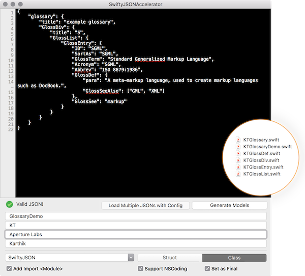

# SwiftyJSONAccelerator (Model file Generator For Swift 3) macOS app and CLI Interface.

[](https://travis-ci.org/insanoid/SwiftyJSONAccelerator) [](https://codecov.io/gh/insanoid/SwiftyJSONAccelerator)

**Version v1.4.0 Released!**

- Generate models from multiple JSON files in a folder at with one click!
- CLI interface - JSON to code directly from CLI, [read more about how it works!](#CLI)
- Removed Cocoapods from the project due to CLI not being able to work with pods, switched to sub-modules.
- Minor bug fixes.
- Better installation directly from the repo with `make install`.

[Previous Release Notes](#previous-releases)

## Installing

### App Installation

- **With CLI:** Download the repo, run the script and you are good to go!

  ```
  git clone https://github.com/insanoid/SwiftyJSONAccelerator.git
  cd SwiftyJSONAccelerator
  make install
  cd ..
  rm -rf SwiftyJSONAccelerator
  ```

- **Application Only:** [Download the .app(v1.4.0)](https://github.com/insanoid/SwiftyJSONAccelerator/releases/download/v1.4.0/SwiftyJSONAccelerator.zip)

## Features

A swift model generator like the Objective-C [JSONAccelerator](http://nerdery.com/json-accelerator). Formats and generates models for the given JSON and also breaks them into files making it easy to manage and share between several models.

The models that are generated depend on JSON object mapping libraries, currently the model can be generated to depend on any of the below mentioned mapping libraries:

- [SwiftyJSON](https://github.com/SwiftyJSON/SwiftyJSON)
- [Hearst-DD/ObjectMapper](https://github.com/Hearst-DD/ObjectMapper)
- [Marshal](https://github.com/utahiosmac/Marshal)

Currently, the pattern is very similar to its Objective-C counterpart. It generates classes with following properties.

- Initalize with `JSON` (SwiftyJSON or ObjectMapper) or Initalize with `Any`
- Optional `NSCoding` compliance.
- Convert object to `Dictionary` for description printing.



- Simple configurable interface for generation of file.
- Each class in the JSON is generated as a file.
- Click `Load Multiple JSONs with Config` to generate all possible models for given folder with JSON files, note this needs a `.config.json` as this uses the CLI logic internally.

### CLI


- CLI simply works with the command `./swiftyjsonaccelerator generate` inside the folder with the JSON file.
- It merges the properties of multiple declarations of the same object (with the same key) in multiple JSON files into a single assimilated model.
- it requires a `.config.json` file to function. The following are the customisable attributes:

  - `destination_path`: Path for the models to be saved at. (if not provided takes the path of the JSON files)
  - `author_name`: Name of the author for the file header.
  - `company_name`: Name of the company for the file header.
  - `construct_type`: if models should be `struct` or `class`. (Default is `class`)
  - `model_mapping_library`: Library to use `Marshal`,`SwiftyJSON` or `ObjectMapper`. (Default is `SwiftyJSON`)
  - `support_nscoding`: If `NSCoding` protocol needs to be implemented. (Only works with `class`, default as `false`)
  - `is_final_required`: Should the model be marked as `final`. (Only works with `class`, default as `false`)
  - `is_header_included`: Should the library header be included in the model file (default as `false`)

- See [test.config.json](https://github.com/insanoid/SwiftyJSONAccelerator/blob/master/SwiftyJSONAcceleratorTests/Support%20Files/MultipleModelTests/test_config.json) is an example. The config file should be in the same folder as the models.

- You can use `./swiftyjsonaccelerator generate -p path/to/json/files` to load JSON files at a particular location.

## Adding New Libraries

- Add a new type in `JSONMappingLibrary` in [Constants.swift](SwiftyJSONAccelerator/Constants.swift).
- Follow the examples in [Library-Extensions](SwiftyJSONAccelerator/Library-Extensions) and create a struct implementing`ModelFile`. Follow the other extensions for SwiftyJSON and ObjectMapper, they tell you what all you can replace based on your libraries specification. You will also have to add the file to `SJAccelerator/FileGenerator` as string unfortunately for now.
- Do the necessary UI changes for the dropdown.
- Add tests for your library.

## Previous Releases

**Version v1.3.0 Released!**

- Serialisation keys moved into a struct for clarity.
- Minor fixes for Marshal and ObjectMapper.
- Generated comments now updated to the new Swift 3 Markup.

**Version v1.2.0 Released!**

- Now supports [Marshal](https://github.com/utahiosmac/Marshal)! One of the fastest JSONSerialisation class out there! [(Read more)](https://github.com/bwhiteley/JSONShootout)
- Set `class` as `final`.
- `init` marked as `required` by default for `class`.

## Swift 2?

[Download (v0.0.6)](https://github.com/insanoid/SwiftyJSONAccelerator/releases/download/v0.0.6/SwiftyJSONAccelerator.zip), the older version of the project, please keep in mind it is **no longer supported**.

## Todo

There is a lot more to do, follow the [issues section](https://github.com/insanoid/SwiftyJSONAccelerator/issues), I usually try to follow up or keep the list updated with any new ideas which I plan to implement.

- Find solution for CLI not to have static text for templates in code.
- Add more comprehensive tests for CLI related code.
- Brew setup for the CLI.
- Adding support for better libraries mentioned [here](https://github.com/bwhiteley/JSONShootout).
- Creating a better UI for the application.

## Contributions and Requests

Any suggestions regarding code quality of the app, generated code's quality, Swift related improvements and pull requests are all very welcome. Please make sure you submit the pull request to the next release branch and not the master branch.

## License

[MIT License](LICENSE) / [Karthikeya Udupa](https://karthikeya.co.uk)
